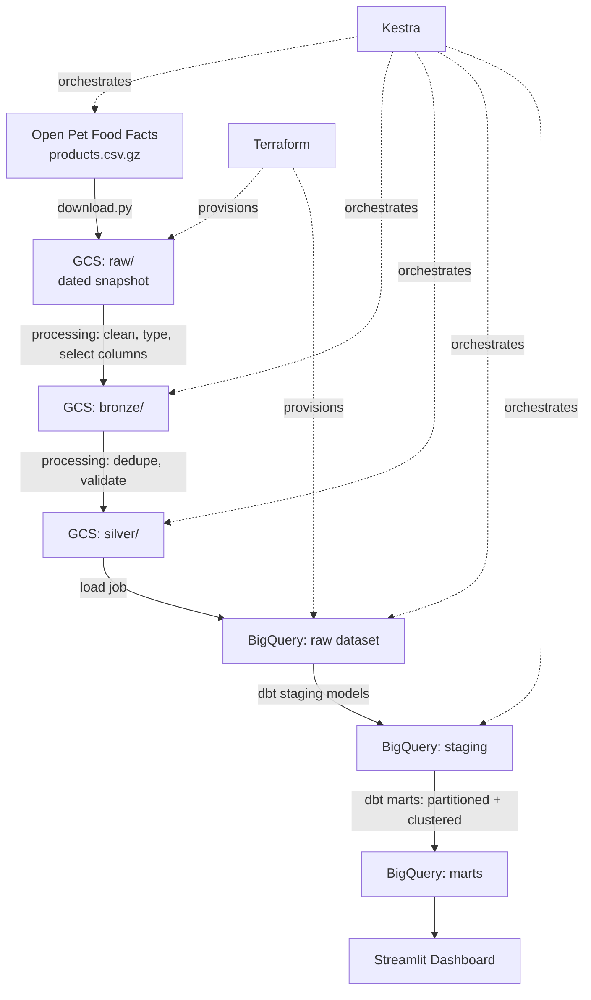

# Architecture

## Overview

The Pet Food Analytics Platform is a batch data pipeline that ingests the
Open Pet Food Facts dataset, processes it through a medallion-style
layered data lake, loads it into a cloud data warehouse, transforms it
into analytics-ready tables, and serves the results through a dashboard.
The entire daily pipeline is orchestrated by Kestra.

## Pipeline Flow

## Layers

| Layer | Location | Responsibility |
|---|---|---|
| Raw | `GCS: raw/{date}/` | Byte-for-byte source snapshot, untouched |
| Bronze | `GCS: bronze/{date}/` | Typed, column-selected, still row-level |
| Silver | `GCS: silver/{date}/` | Deduplicated, validated, analysis-ready |
| Warehouse (raw) | `BigQuery: raw` | Loaded silver data, no transformations |
| Warehouse (staging) | `BigQuery: staging` | dbt staging models — renamed/cast columns |
| Warehouse (marts) | `BigQuery: marts` | Partitioned + clustered fact/dim tables |

## Orchestration

Kestra schedules and runs the full sequence daily:
`download → process (bronze) → process (silver) → load to BigQuery → dbt run`.
Each step remains an independently runnable script; Kestra sequences them
and handles retries/scheduling rather than containing pipeline logic itself.

## Infrastructure as Code

Terraform provisions the GCS bucket and BigQuery datasets, along with the
service account and IAM bindings the pipeline needs to run.

## Dashboard

A Streamlit app reads from the BigQuery marts layer and presents:
- Distribution of products by category (categorical)
- Product additions over time (temporal)

## Key Design Decisions

See `docs/adr/` for the full reasoning behind each major choice:
- [001 — Batch over streaming](adr/001-batch-over-streaming.md)
- [002 — Cloud (GCP) over local-first](adr/002-cloud-over-local.md)
- [003 — BigQuery over DuckDB as warehouse](adr/003-bigquery-over-duckdb.md)
- [004 — DuckDB for local profiling](adr/004-duckdb-for-data-profiling.md)
- [005 — Silver Layer at one row per product](adr/005-one-row-per-product.md)
- [006 — Bronze/Silver Layer definition](adr/006-bronze-silver-definition.md)